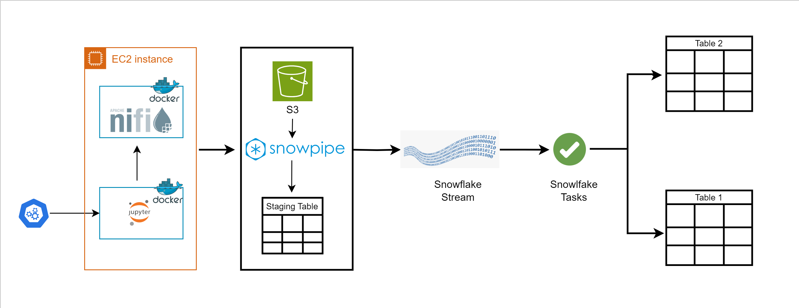
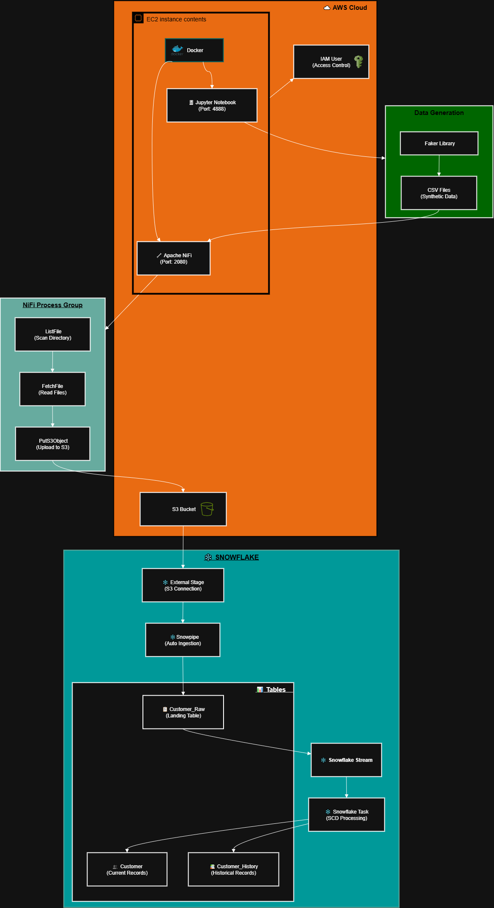

# Slowly Changing Dimensions (SCD) Project with Snowflake, NiFi, Docker & AWS

This repository contains the material and setup for a **Slowly Changing Dimensions (SCD)** project using **Snowflake**, **AWS**, **Apache NiFi**, **Docker**, and **Jupyter Notebook**.

The purpose of this project is to simulate a **real-world data engineering pipeline** — from **data generation** to **data ingestion** into **Snowflake**, with automation and streaming capabilities.

---

## Table of Contents

1. [Introduction](#introduction)
2. [Architecture Overview](#architecture-overview)
3. [Step-by-Step Project Setup](#step-by-step-project-setup)
   - [Step 1: AWS EC2 Instance Setup](#step-1-aws-ec2-instance-setup)
   - [Step 2: IAM User & S3 Bucket Creation](#step-2-iam-user--s3-bucket-creation)
   - [Step 3: Installing Docker & Docker Compose](#step-3-installing-docker--docker-compose)
   - [Step 4: Running Jupyter & NiFi on Docker](#step-4-running-jupyter--nifi-on-docker)
   - [Step 5: Generating Fake Data Using Jupyter](#step-5-generating-fake-data-using-jupyter)
   - [Step 6: Transferring Data to NiFi](#step-6-transferring-data-to-nifi)
   - [Step 7: NiFi Data Flow Setup](#step-7-nifi-data-flow-setup)
   - [Step 8: Loading Data to AWS S3](#step-8-loading-data-to-aws-s3)
   - [Step 9: Setting Up Snowflake](#step-9-setting-up-snowflake)
   - [Step 10: Creating Snowpipe & Tables](#step-10-creating-snowpipe--tables)
4. [Current Progress](#current-progress)
5. [Next Steps](#next-steps)
6. [Project Diagram](#project-diagram)
7. [Conclusion](#conclusion)

---

## Introduction

This project demonstrates the process of handling **Slowly Changing Dimensions (SCD)** — a data warehousing concept used to manage and track historical data changes over time.

We designed and implemented a **modern data pipeline** that:
- Generates fake customer data using **Jupyter Notebook**
- Moves that data using **Apache NiFi**
- Stores it on **AWS S3**
- Automatically ingests it into **Snowflake** using **Snowpipe** and **Streams**

---

## Architecture Overview

Below is the high-level architecture of our project:



### Components Involved:
- **AWS EC2 Instance** → Hosts Docker containers running NiFi and Jupyter Notebook  
- **Docker** → Provides isolated environments for services  
- **Apache NiFi** → Handles data flow automation between systems  
- **AWS S3** → Used as staging storage for data files  
- **Snowpipe** → Automates data loading from S3 into Snowflake  
- **Snowflake Stream & Tasks** → Tracks and processes incremental data changes  
- **Snowflake Tables** → Final destination for processed data  

---

## Step-by-Step Project Setup

### Step 1: AWS EC2 Instance Setup
We started by creating an **EC2 instance** on **AWS**.  
This instance serves as the main environment where NiFi and Jupyter run inside Docker containers.

**My configuration:**
- OS: Amazon Linux 2
- Type: m7i-flex.large/ t2.smal (recommended)
- vcpus: 2
- Security Group: 2080 (NiFi), 4888 (Jupyter)

---

### Step 2: IAM User & S3 Bucket Creation
Next, we created:
- An **IAM user** with `AmazonS3FullAccess`
- An **S3 bucket** to store our data files and integrate with **Snowflake**

---

### Step 3: Installing Docker & Docker Compose

We installed **Docker** and **Docker Compose** on our EC2 instance:

```bash
# Update
sudo yum update -y

# Install Docker
sudo yum install docker -y
sudo systemctl start docker
sudo systemctl enable docker

# Install Docker Compose (latest version)
sudo curl -L "https://github.com/docker/compose/releases/download/1.29.2/docker-compose-$(uname -s)-$(uname -m)" \
  -o /usr/local/bin/docker-compose
sudo chmod +x /usr/local/bin/docker-compose
docker-compose --version

# check
docker --version

nano docker-compose.yml
sudo yum install -y libxcrypt-compat

sudo docker-compose up -d

docker ps

mkdir FakeDataset

````

---

### Step 4: Running Jupyter & NiFi on Docker

After installation, we ran **Jupyter Notebook** and **Apache NiFi** containers:

* **Jupyter:** Accessible on port `4888`
* **NiFi:** Accessible on port `2080`

Each runs inside its own Docker container for isolation and flexibility.

---

### Step 5: Generating Fake Data Using Jupyter

Inside Jupyter, we installed the Python library **Faker** to generate synthetic customer data.

```python
pip install faker
from faker import Faker
import csv
import random
from decimal import Decimal
from datetime import datetime

RECORD_COUNT = 10000
fake = Faker()

current_time = datetime.now().strftime("%Y%m%d%H%M%S")
# print(current_time)

def create_csv_file():
    with open(f'FakeDataset/customer_{current_time}.csv', 'w', newline='') as csvfile:
        fieldnames = ["customer_id","first_name","last_name","email","street",
                      "city","state","country"
                     ]
        writer = csv.DictWriter(csvfile, fieldnames=fieldnames)

        writer.writeheader()
        for i in range(RECORD_COUNT):
            #print(i)
            writer.writerow(
                {
                    "customer_id": i,#fake.random_int(min=1, max=10000),
                    'first_name': fake.first_name(),
                    'last_name': fake.last_name(),
                    'email': fake.email(),
                    'street': fake.street_address(),
                    'city': fake.city(),
                    'state': fake.state(),
                    'country': fake.country()
                }
            )

if __name__ == '__main__':
    create_csv_file()
```

This created a realistic dataset named `customers.csv`.

---

### Step 6: Transferring Data to NiFi

Next, we switched to the **EC2 Linux terminal**.

We accessed the **NiFi container bash** and created a folder to store our generated data:

```bash
docker exec -i -t nifi bash
mkdir scd
```

Then we copied the generated CSV file from Jupyter’s folder to NiFi’s directory:

```bash
cp /opt/workspace/nifi/FakeDataset/customer_20251007194705.csv scd/
```

---

### Step 7: NiFi Data Flow Setup

Inside NiFi’s UI, we created a **Process Group** that performs the following sequence:

1. **ListFile** → Lists all files in the NiFi data folder
2. **FetchFile** → Fetches each listed file
3. **PutS3Object** → Uploads files to AWS S3

To establish the connection between **NiFi** and **S3**, we configured AWS credentials (Access Key & Secret Key) in NiFi’s controller settings.

Once the flow was executed, NiFi successfully uploaded our CSV data to the **S3 bucket**.

---

### Step 8: Loading Data to AWS S3

With NiFi automation in place, files were automatically uploaded to the S3 bucket — serving as our **staging area** for Snowflake.

---

### Step 9: Setting Up Snowflake

In Snowflake, we created several tables for handling customer data and change history:

* **CUSTOMER_RAW**
* **CUSTOMER**
* **CUSTOMER_HISTORY**

Each table was designed with columns to support **SCD operations** like versioning and timestamp tracking.

---

### Step 10: Creating Snowpipe & Tables

We then connected Snowflake to our S3 bucket using an **External Stage**:

```sql
CREATE OR REPLACE STAGE my_s3_stage
URL='s3://your-bucket-name/'
STORAGE_INTEGRATION = my_integration;
```

Next, we created a **Snowpipe** to automatically ingest new files from S3:

```sql
CREATE OR REPLACE PIPE my_snowpipe
AS
COPY INTO CUSTOMER_RAW
FROM @my_s3_stage
FILE_FORMAT = (TYPE = 'CSV' FIELD_OPTIONALLY_ENCLOSED_BY='"');
```

The **Snowpipe** automatically detects new files and loads them into **Snowflake** without manual intervention.

---

## Current Progress

Completed:

* EC2 setup
* Docker installation
* Jupyter + NiFi containers
* Fake data generation
* NiFi flow configuration
* S3 integration
* Snowflake stage and pipe creation

In Progress:

* Implementing **Snowflake Streams and Tasks**
* Automating SCD updates between raw, history, and final tables

---

## Next Steps

* Configure **Snowflake Streams** to track data changes
* Create **Snowflake Tasks** to automate updates between tables
* Implement **SCD Type 2 logic** for maintaining change history
* Build **visual dashboards** for data insights

---

## Project Diagram

Here’s the complete architecture of this project:



---

## Conclusion

This project demonstrates how multiple tools in the data engineering ecosystem can work together seamlessly to create a **robust, automated data pipeline**.

We integrated:

* **AWS (EC2 + S3)** for infrastructure and storage
* **Docker** for isolated environments
* **NiFi** for data flow automation
* **Snowflake** for modern cloud data warehousing

> *The project is still in progress — more updates are on the way!*
> **Stay tuned!**
